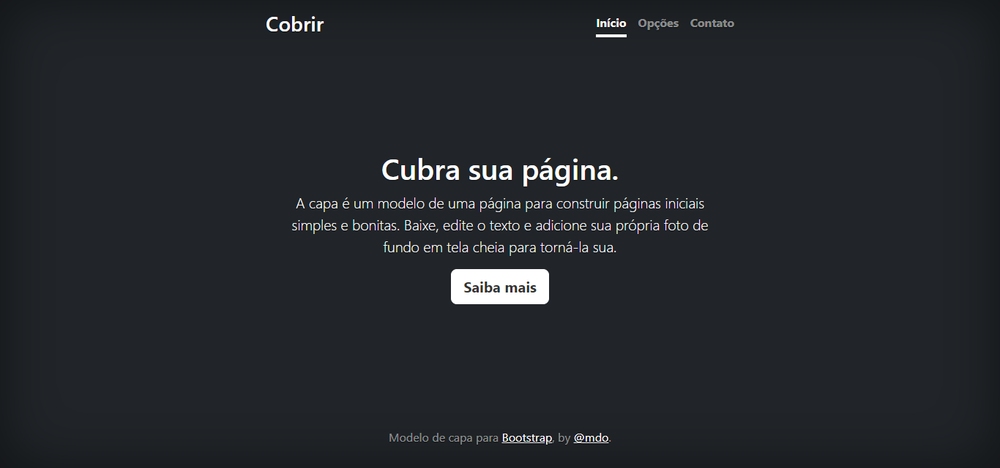

# Índice
[Projeto - Portifólio para escrita do README](#projeto---portif%C3%B3lio-para-escrita-do-readme)  
[Descrição](#descri%C3%A7%C3%A3o)  
[Funcionalidades](#funcionalidades)  
[Tecnologias utilizadas](#tecnologias-utilizadas)  
[Fontes consultadas](#fontes-consultadas)  
[Autores](#autores)  

# 📋Projeto - Portifólio para escrita do README

## 📄Descrição 

## ⚙️Funcionalidades

### 👩🏻‍💻Tecnologias utilizadas

## 📚Fontes consultadas

## 👥Autores